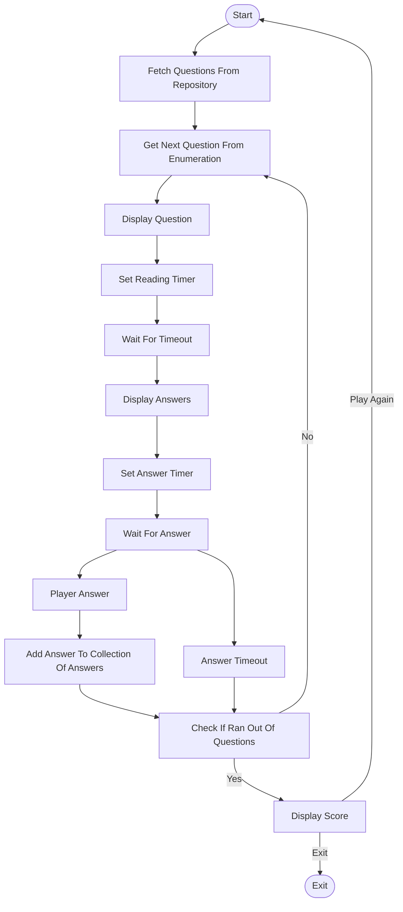

# Simple Quiz with Unity

This is a simple quiz game made with Unity. The game consists of a series of
questions, each with multiple-choice answers. The player selects an answer and,
in the end, receives a score based on the number of correct answers.

# Objectives

- Apply Data-Driven Design to model the objects, considering the limitations of
  the framework.
- Make the code modular and extensible, allowing for easy addition of new types
  of questions and answers.
- Apply dependency injection to reduce coupling with references to objects in
  the scene.
- Use Unity's built-in features to create a simple and effective UI.

# Libraries Used (besides the libraries provided by Unity)

- [Extenject](https://github.com/Mathijs-Bakker/Extenject): A fork of the
  original Zenject library, which is a dependency injection framework for Unity.
- [ScriptableObject
  Architecture](https://github.com/DanielEverland/ScriptableObject-Architecture):
  A framework for creating data-driven and event-driven architectures in Unity
  using ScriptableObjects.
- [Odin Serializer](https://github.com/TeamSirenix/odin-serializer): A powerful
  and flexible serialization framework for Unity that allows for easy
  serialization and deserialization of complex data structures.
- [NuGetForUnity](https://github.com/GlitchEnzo/NuGetForUnity): A Unity package
  manager that allows you to easily install and manage NuGet packages in your
  Unity projects.
- [CSharpFunctionalExtensions](https://github.com/vkhorikov/CSharpFunctionalExtensions):
  A library that provides functional programming features for C#.

# Game Flow

1. The game starts by fetching questions from a repository, which returns an
   enumeration of questions.
2. Then the next question is queried from the enumeration is displayed to the
    player.
3. The game sets a reading timer for the player to read the question.
4. After the reading timer expires, the game displays the possible answers to the
   question.
5. The game sets an answer timer for the player to select an answer.
6. The game waits for the player to select an answer or for the answer timer to
   expire.
7. If the player selects an answer, it is added to the collection of answers.
8. If the player does not select an answer before the timer expires, the game
   does not add an answer to the collection.
9. The game checks if there are more questions to display. If there are, it goes
   back to step 2. If not, it displays the score.
10. The player can choose to play again or exit the game.
11. If the player chooses to play again, the game goes back to step 1. If the
    player chooses to exit, the game ends.